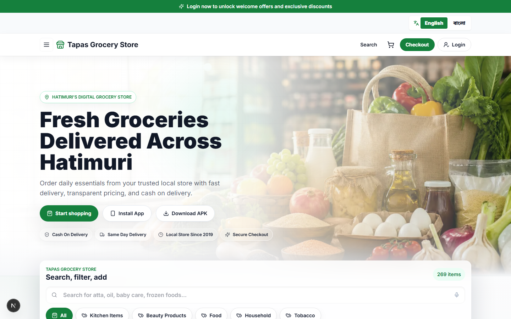
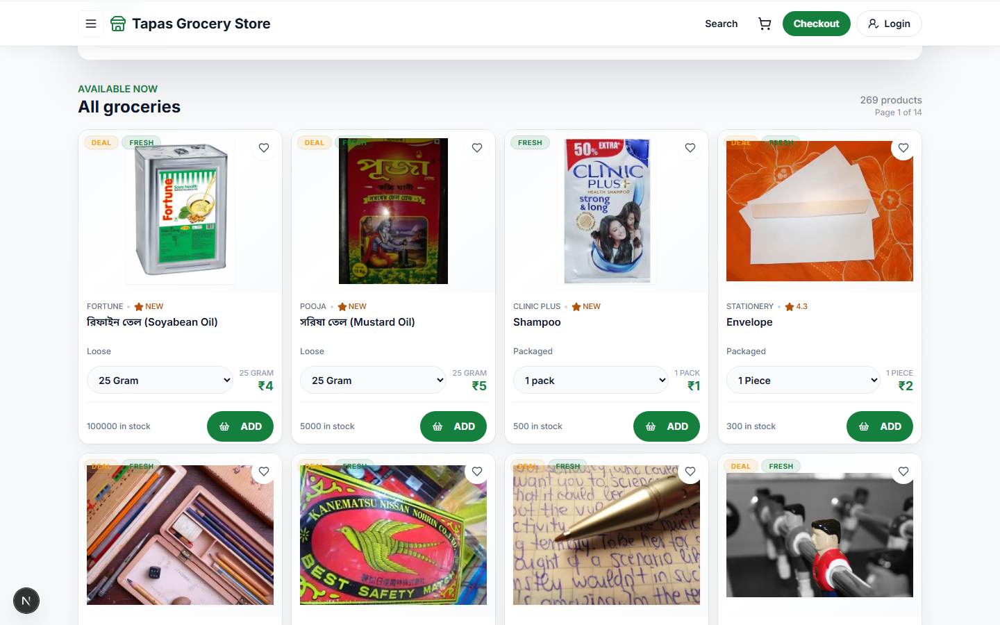
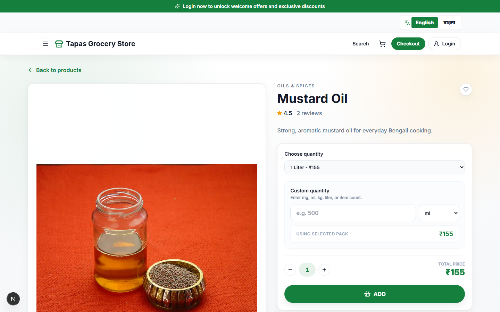
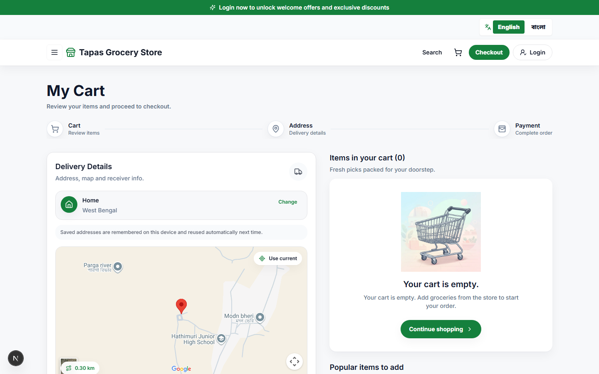
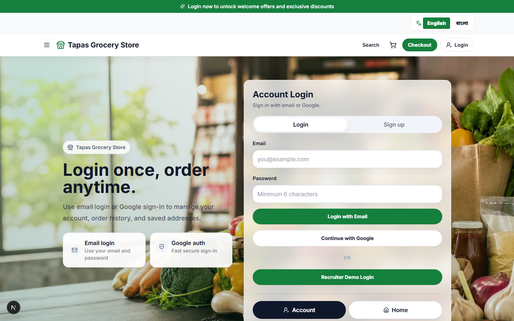

# Tapas Grocery Store

Tapas Grocery Store is a mobile-first grocery ordering app for a local store in Hatimuri. Customers can browse products, search and filter items, add groceries to a cart, enter delivery details, and place cash-on-delivery orders. The admin side supports product, order, user, inventory, analytics, and notification workflows.

## Screenshots

**Home page**



**Product catalog**



**Product detail with reviews**



**Cart & checkout**



**Login**



## Features

- Responsive storefront built for mobile grocery shopping
- Product browsing with variants, search, filters, favorites, and reorder support
- Product reviews and star ratings across the catalog
- Cart and checkout with mobile number and full address validation
- Location-based delivery calculation from the shop location
- Cash-on-delivery ordering (online payment gateway wiring is in place, pending Razorpay verification)
- Active promo codes with automatic discount validation at checkout
- A login banner and welcome-offer popup encouraging signed-out visitors to create an account
- Customer login with Supabase email/password and Google OAuth, plus a view-only recruiter/demo login for browsing without an account
- Account page, order history, and order tracking
- A fully rule-based store assistant (no external AI API key required) that answers questions about products, delivery, payments, promo codes, and policies
- Admin dashboard for products, orders, users, delivery ETA, refunds, analytics, and CSV import/export
- Supabase database, authentication, storage, RLS policies, and product image uploads
- English and Bengali UI support
- Web Push notifications for admin order alerts
- PWA support with a downloadable Android APK path

## Tech Stack

- Next.js App Router
- React 18
- TypeScript
- Tailwind CSS
- Supabase
- NextAuth
- Razorpay
- Fuse.js
- Recharts
- Web Push
- lucide-react

## Project Structure

```text
src/app/                 Next.js routes, pages, and API endpoints
src/components/          Shared UI, storefront, checkout, and provider components
src/lib/                 Auth, Supabase, delivery, invoice, formatting, and app helpers
src/hooks/               Reusable React hooks
src/types/               Type declarations
public/                  PWA assets, icons, images, service worker, and APK download
supabase/migrations/     Database schema, policies, and seed data
docs/                    Extra project documentation
scripts/                 Utility scripts
```

## Getting Started

### Requirements

- Node.js 20 or newer
- npm
- Supabase project
- Google OAuth credentials, if Google login is enabled
- Razorpay credentials, if online payment is enabled

### Installation

```bash
npm install
```

Create a local environment file:

```bash
cp .env.example .env
```

Fill in the required values in `.env`. Do not commit `.env`.

### Environment Variables

```env
NEXT_PUBLIC_SUPABASE_URL=
NEXT_PUBLIC_SUPABASE_ANON_KEY=
SUPABASE_SERVICE_ROLE_KEY=

NEXTAUTH_SECRET=
NEXTAUTH_URL=http://127.0.0.1:3000
ADMIN_PASSWORD=
GOOGLE_CLIENT_ID=
GOOGLE_CLIENT_SECRET=

RAZORPAY_KEY_ID=
RAZORPAY_KEY_SECRET=

NEXT_PUBLIC_VAPID_PUBLIC_KEY=
VAPID_PRIVATE_KEY=
VAPID_SUBJECT=mailto:admin@tapas-grocery.local
```

The store assistant does not call any external AI API and needs no API key — it answers from a hardcoded rule set in `src/lib/assistant.ts`.

### Run Locally

```bash
npm run dev
```

Open:

```text
http://127.0.0.1:3000
```

### Build

```bash
npm run build
npm run start
```

### Lint

```bash
npm run lint
```

## Supabase Setup

The database migration is located at:

```text
supabase/migrations/202605150001_init_tapas_grocery.sql
```

To apply it from the Supabase dashboard:

1. Open your Supabase project.
2. Go to **SQL Editor**.
3. Open the migration file from this repository.
4. Paste the SQL into the editor.
5. Run the SQL.

Enable these authentication providers:

- Email
- Google

Recommended redirect URLs:

```text
http://localhost:3000/login
http://127.0.0.1:3000/login
https://tapas-grocery.vercel.app/login
```

The app also expects a Supabase Storage bucket for product images. Create or verify the bucket used by the product image upload flow, commonly:

```text
product-images
```

More Supabase notes are available in [supabase/README.md](supabase/README.md).

## Delivery Rules

Delivery calculation is implemented in:

```text
src/lib/delivery.ts
```

Shop coordinates are stored in:

```text
src/lib/location.ts
```

Current shop location:

```text
23.457619, 86.151317
```

Delivery rules:

- Up to 300 meters: ₹3 delivery fee
- Above 300 meters: ₹1 is added for every extra 100 meters
- Free delivery within 1.5 km when the cart total is above ₹299
- Free delivery anywhere in the service area when the cart total is ₹499 or more
- Above 20 km: delivery is unavailable

## Promo Codes

Active promo codes are defined in `src/lib/mock-data.ts` and validated in `src/lib/promos.ts`:

| Code | Discount | Minimum cart |
| --- | --- | --- |
| `TAPAS10` | 10% off | ₹200 |
| `LOCAL50` | ₹50 off | ₹500 |
| `WELCOME50` | 50% off (first order) | ₹100 |
| `MISSYOU20` | 20% off | ₹150 |
| `WEEKEND15` | 15% off | ₹250 |
| `BIGBASKET100` | ₹100 off | ₹1000 |
| `FRESH30` | 30% off | ₹300 |

## Store Assistant

`src/lib/assistant.ts` implements a keyword/intent-matching assistant with no external dependency — it can answer questions about product price and stock, delivery fees and area, active promo codes, payment methods, order tracking, refunds, account creation, and store policies, and falls back to searching the live product catalog for anything else. The chat widget (`src/components/ai-assistant.tsx`) also surfaces a list of suggested questions to help users get started.

## Admin Access

The admin area is available at:

```text
/admin
```

Set `ADMIN_PASSWORD` in `.env` for local and production admin access.

## Recruiter / Demo Login

The login page includes a "Recruiter Demo Login" option that lets anyone browse the full storefront — products, cart, and checkout flow — without creating a real account. It is intentionally view-only: placing a real order and saving addresses are disabled while in demo mode, and the admin dashboard cannot be accessed through it.

## PWA and Android APK

The app includes:

- `public/manifest.webmanifest`
- `public/sw.js`
- `public/downloads/tapas-grocery.apk`

The APK download button is connected to:

```text
public/downloads/tapas-grocery.apk
```

For Android packaging instructions, see [docs/ANDROID_APK.md](docs/ANDROID_APK.md).

## Deployment

Before deploying:

1. Add all environment variables to the hosting provider.
2. Apply the Supabase migration.
3. Enable Supabase Email and Google auth providers.
4. Add the production auth redirect URL.
5. Create or verify the product image storage bucket.
6. Set `NEXTAUTH_URL` to the production domain.
7. Run a production build locally:

```bash
npm run build
```

This project is ready for deployment on Vercel or any platform that supports Next.js.

## Useful Commands

```bash
npm run dev      # Start local development server
npm run build    # Create production build
npm run start    # Start production server
npm run lint     # Run lint checks
```

## Notes

- Never commit `.env` or secret keys.
- Keep Supabase RLS policies enabled.
- Use service role keys only on the server.
- Direct APK downloads are best for private testing; the Play Store is better for public distribution.
